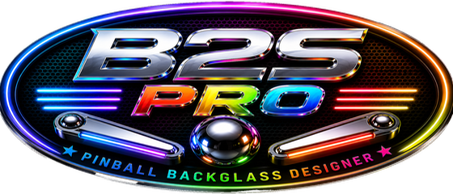

# B2S Pro

B2S Pro is a modernized backglass designer and animation workspace for creating and editing `directB2S` backglasses for Visual Pinball. It preserves the established B2S workflow while adding more capable lighting, flashers, snippets, animation, motion, physics, layering, and score tools.

## Current release

- B2S Pro Backglass Designer: **1.0.1**
- B2S Pro Server: **3.0.0**
- Platform: Windows

The tested runtime and source packages are distributed from the [B2S Pro Releases](https://github.com/KWildman69/B2S-Pro/releases/latest) page. Compiled release files are not stored in the source tree.

## Highlights

- Modernized workspace, toolbar, menus, and persistent window layouts
- Full Layers window with ordering, visibility, locking, naming, masks, and direct object editing
- Add Snippet, Make Snippet, and Quick Selection workflows
- One-picture and animated-GIF animation creation
- One-image rotation, score rotation, pivot animation, and mechanical-wheel animation
- Optional realistic 3D EM score reels with adjustable backlighting, light temperature, drum depth, and glass reflection
- Motion paths with editable entry and exit behavior
- Trough animation with live ball-count updates, custom PNG artwork per ball, rolling, and feeder respawn
- Physics boundaries, bumpers, switches, flippers, and launcher support
- Pixel-level lamp lighting that preserves dark-image contrast
- Dedicated high-intensity flasher editor with live full-backglass preview, mask refinement, temperature, diffusion, and radial-spike controls
- Embedded illustrated B2S Pro help while retaining the original help material
- Backward-compatible handling for established backglass projects and legacy animation behavior

## Documentation

The illustrated [B2S Pro online guide](https://kwildman69.github.io/B2S-Pro/) is published from the documentation source in this repository. The same help content is embedded in the application so it cannot be separated from the installed program.

The original Backglass Designer help remains intact alongside the new B2S Pro feature guide.

## Source layout

- `src/designer` — B2S Pro Backglass Designer 1.0.1 source
- `src/server` — B2S Pro Server 3.0.0 source
- `docs/help-source` — complete help project and illustrated documentation
- `CHANGELOG.md` — B2S Pro release history
- `CREDITS.md` — acknowledgements and project lineage

## Building

B2S Pro uses Visual Basic .NET and targets the Windows .NET Framework. Open the applicable solution in Visual Studio 2019 or newer:

- `src/designer/B2SBackglassDesigner.sln`
- `src/server/b2sbackglassserver/B2SBackglassServer.sln`

Build and test both x86 and x64 Designer targets. Server support applications have their own solutions under `src/server`.

## License and credits

B2S Pro is derived from the original Backglass Designer created by Herweh and the B2S Team. Without their work, dedication, and vision, B2S Pro would not have been possible.

Copyright © 2026 Ken Wildman. B2S-derived code remains subject to the original B2S license included in this repository.
